# 🚀 Smart Digital Learning Platform — CodeZen

> **Learn smarter. Code better. Build your future.**

An AI-powered digital learning ecosystem developed by **Team Code Zen** for the Smart India Hackathon. It brings AI tutoring, multi-language interactive coding, structured curricula, practice quizzes, study planning, educational resource discovery, and real-time learning analytics into a single unified platform.

---

| 🏆 Hackathon Information | Details |
|---|---|
| 👥 Team Name | **Code Zen** |
| 🚀 Project Name | **Smart Digital Learning Platform** |
| 🌐 Live Website | [https://smart-digital-learning-platform.vercel.app/](https://smart-digital-learning-platform.vercel.app/) |

---

## 📸 Platform Showcase

### 🌟 Hero Experience
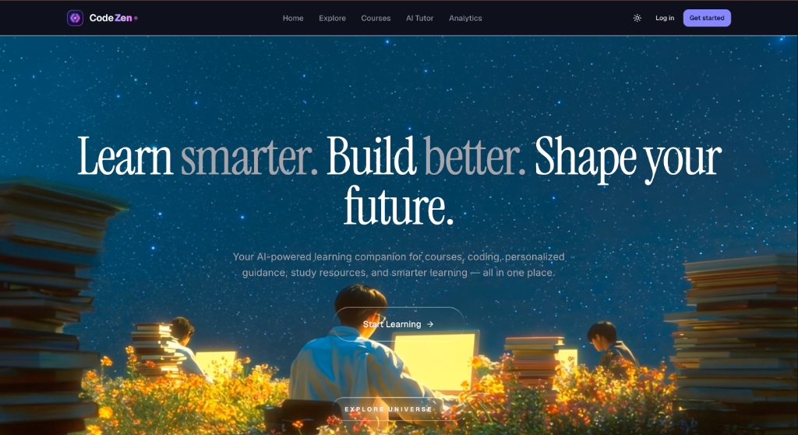
Cinematic entry point showcasing the platform tagline and AI-powered learning companion.

### 🎓 Universal Learning Levels
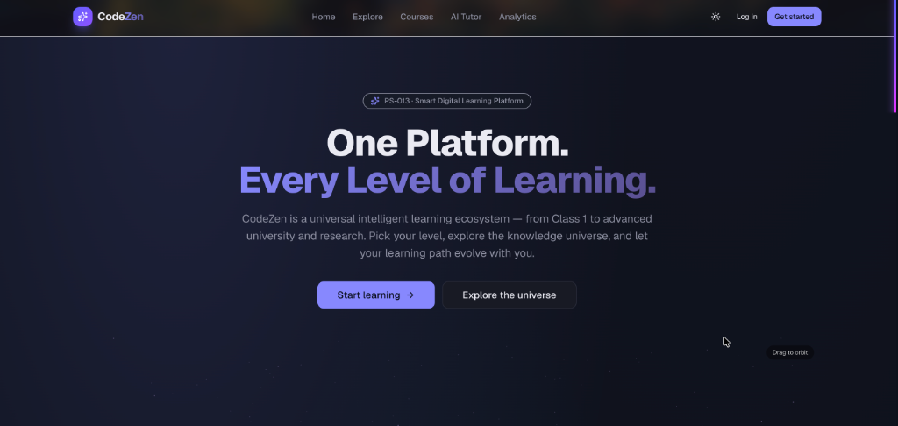
Structured grade and curriculum level selection spanning Class 1 to advanced university research.

### 🌌 3D Knowledge Universe & Solar System
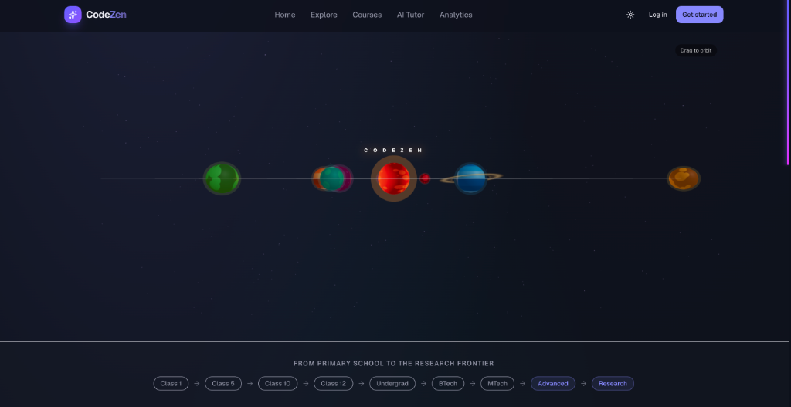
Interactive 3D orbital course navigation connecting domains from primary school to research frontiers.

### 📚 Universe of Knowledge Domains
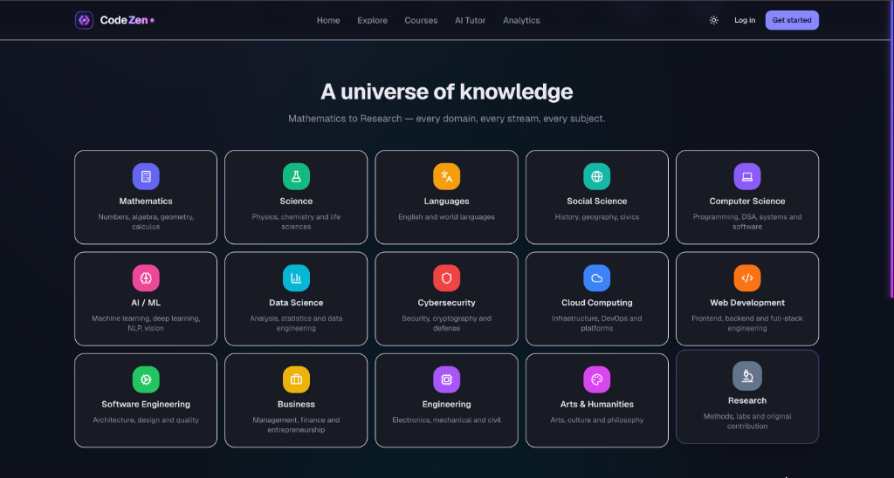
Comprehensive domain catalog covering Mathematics, Science, AI/ML, Data Science, Cybersecurity, Web Dev, and Engineering.

### 🧩 Core Platform Architecture Pillars
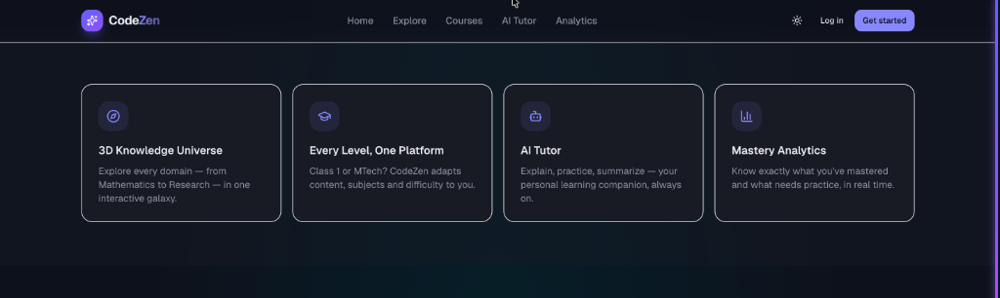
Pillar overview highlighting the 3D Knowledge Universe, Unified Levels, AI Tutor, and Real-Time Analytics.

### 🏠 Landing Page Overview

Modern entry point showcasing the platform's learning ecosystem, domain paths, and interactive 3D universe.

### 📊 Student Dashboard
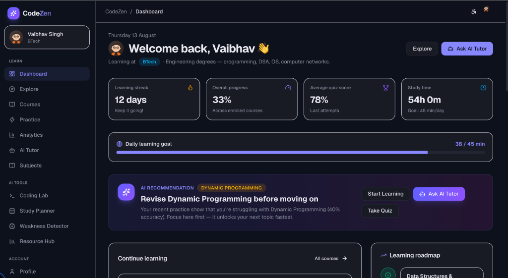
Centralized learning hub for student progress tracking, daily goals, study streaks, and activity metrics.

### 🤖 AI Tutor
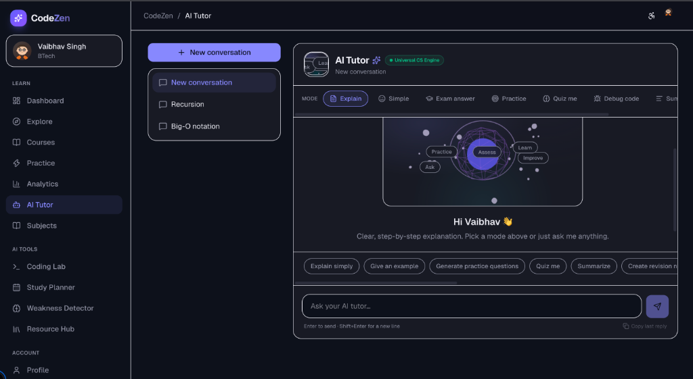
AI-powered academic and coding assistance featuring 10 study modes, live code debugging, and student insights.

### 📚 Course Catalog & Filters
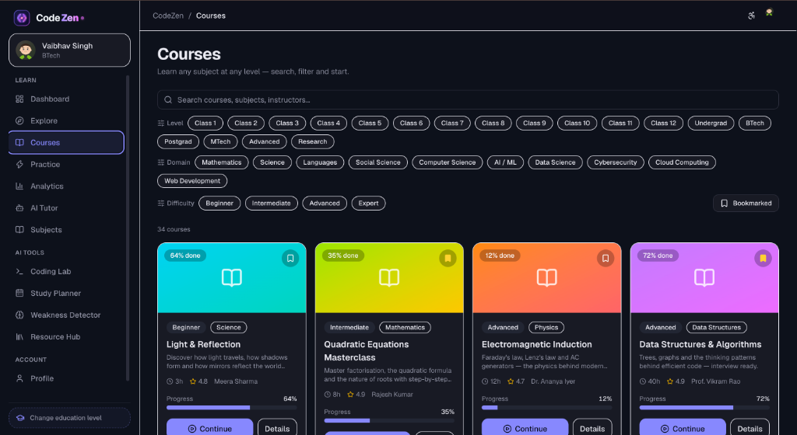
Structured course catalog with multi-grade level, domain, and difficulty filters.

### 📖 Subject Syllabus & Topics
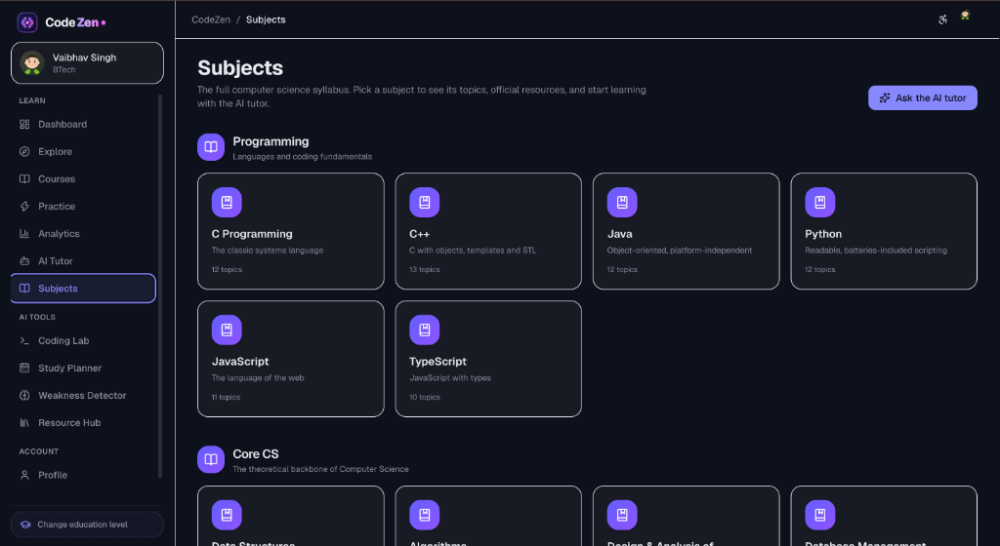
Comprehensive subject breakdown covering programming fundamentals, core computer science, and engineering syllabus.

### 💻 Coding Lab
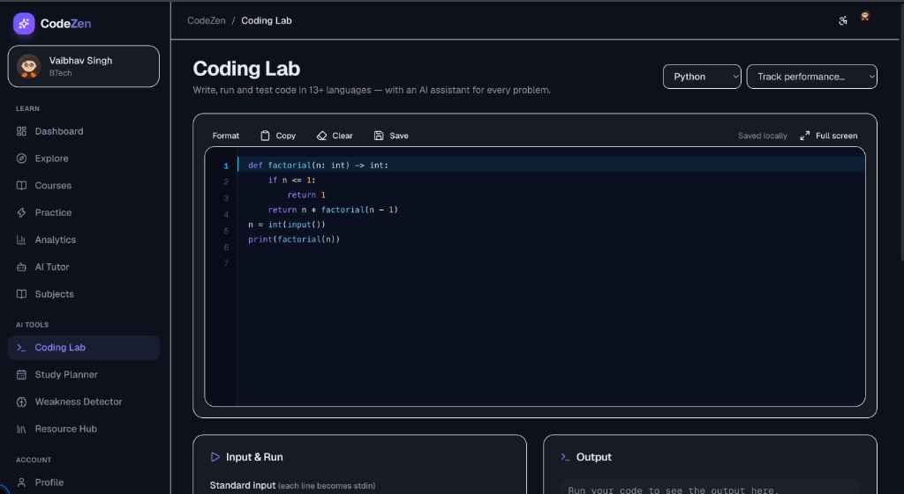
Integrated multi-language programming environment featuring live code execution, test-case runner, and AI code optimization.

### 📅 Study Planner
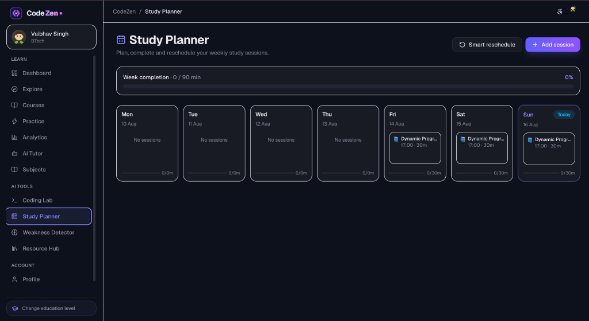
Weekly study session scheduling, smart rescheduling, and habit tracking.

### 🎯 AI Weakness Detector
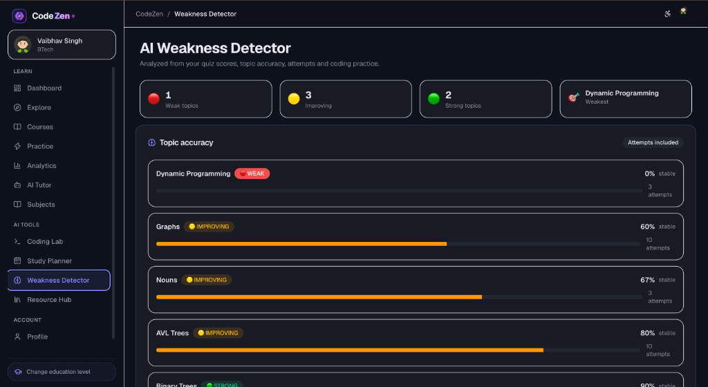
Real-time topic accuracy diagnostics classifying weak, improving, and strong academic areas.

### 🎥 Resource Hub
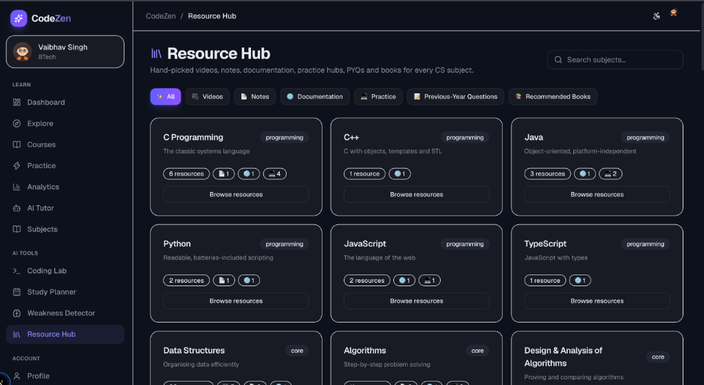
Educational video discovery, notes, documentation, PYQs, and recommended textbooks for every CS subject.

### 👤 Student Profile & Activity Feed
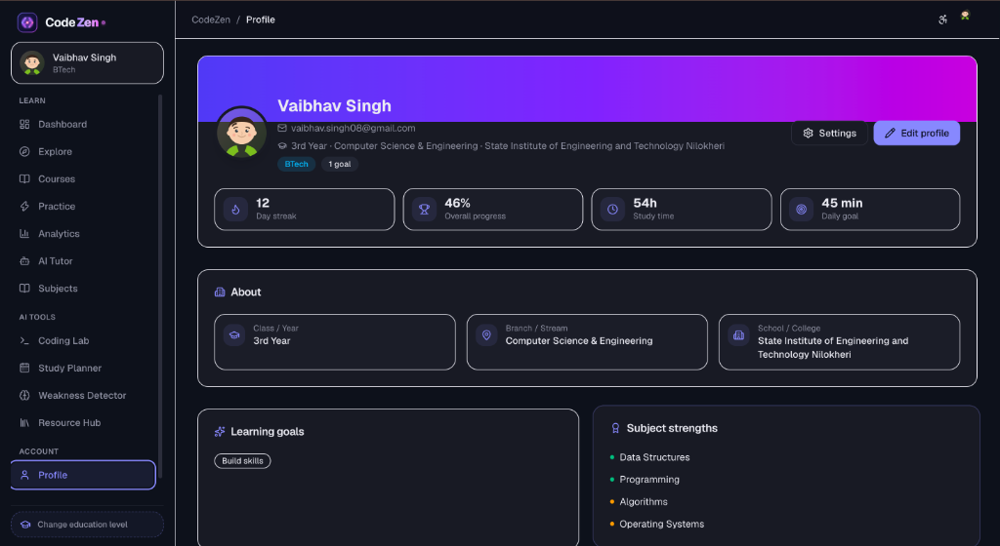
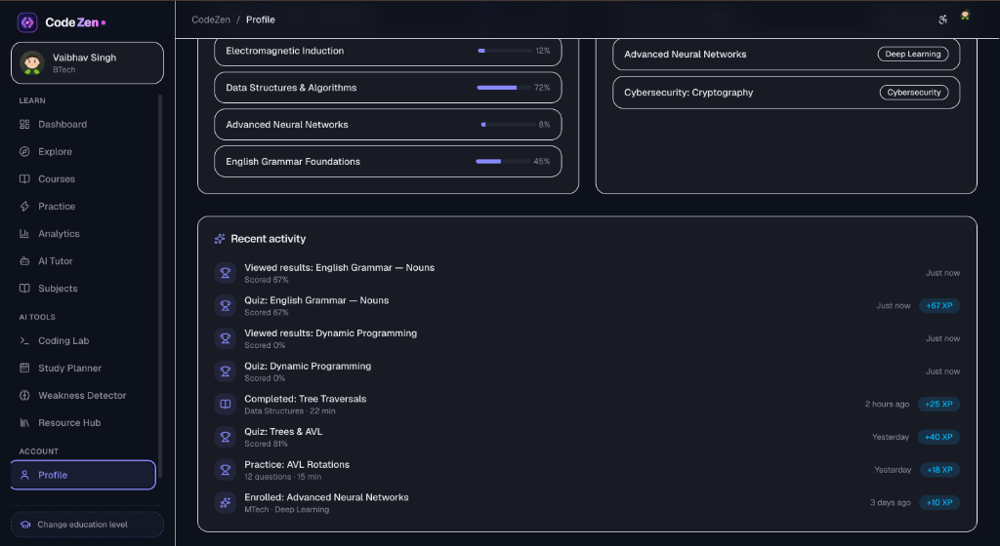
Personalized student profile detailing academic program, study streaks, progress, subject strengths, and real-time XP activity feed.

### 🔐 Authentication & Sign Up
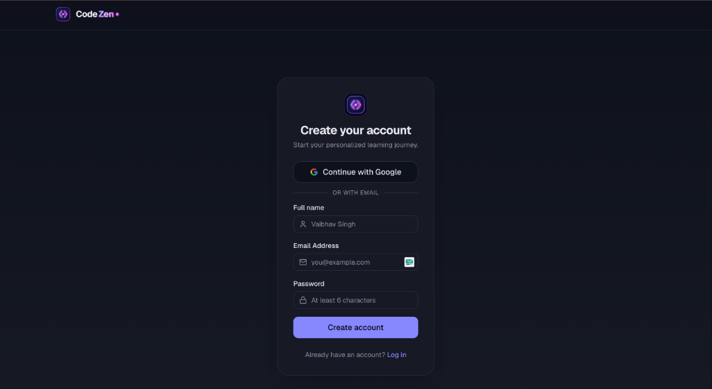
Secure account registration and single sign-on workspace with CodeZen brand styling.

### 👑 Admin Control Panel
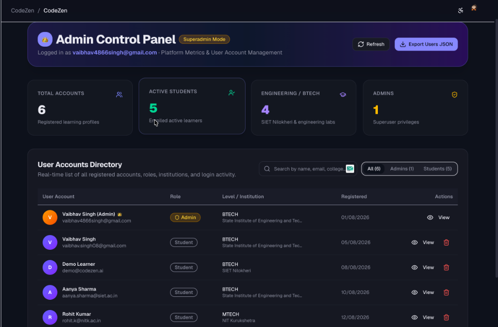
Enterprise-grade administration workspace featuring real-time user metrics, account directory, role management, and JSON data export.

---

## 🌟 About the Project

**Smart Digital Learning Platform** is a full-stack, AI-powered learning environment designed to provide students with a single organized ecosystem for their entire academic journey.

Modern education requires students to learn theoretical concepts, write and debug code, solve practice questions, watch tutorial videos, manage study schedules, and track their preparation progress. Currently, students must juggle 5 to 6 disconnected tools and websites to accomplish these tasks.

The **Smart Digital Learning Platform** solves this fragmentation by combining:
- 🤖 **AI Academic Tutoring**
- 📚 **Structured Courses & Curriculum**
- 💻 **Hands-On Coding Practice**
- 📝 **Interactive Topic-Based Quizzes**
- 📅 **Personalized Study Planning**
- 🎥 **Educational Video Resource Discovery**
- 📊 **Centralized Learning Analytics**

By integrating these features into a seamless workflow, students can focus entirely on understanding concepts and mastering skills without losing context.

---

## 🎯 Problem Statement

Modern students heavily rely on disconnected tools during their learning process:

| Existing Approach | Problem |
|---|---|
| 🎥 **Video Platforms** | Educational content is scattered and uncurated |
| 🤖 **Generic AI Assistants** | Disconnected from curriculum and student context |
| 💻 **External Online Compilers** | Coding practice is isolated from study materials |
| 📄 **Websites & PDFs** | Static resources are hard to search and organize |
| 📅 **Generic Productivity Apps** | Study planning is detached from course progress |
| 📝 **Third-Party Quiz Platforms** | Assessment data is separated from learning history |

### Key Pain Points
- 🔄 **Constant Context Switching**: Students lose focus jumping between browser tabs and standalone tools.
- 📚 **Scattered Resources**: Learning materials, notes, and code snippets are stored in separate places.
- 🎯 **Lack of Personalized Assistance**: Generic tools lack awareness of the student's current grade, course, or weak areas.
- 💻 **Disconnected Hands-On Practice**: Code execution environment is separate from study reading material.
- 📊 **No Unified Progress View**: Students cannot measure overall growth across theory, coding, and quizzes in one view.
- 📅 **Study Routine Friction**: Converting learning goals into actionable daily schedules requires manual effort across apps.

---

## 💡 Our Solution

The Smart Digital Learning Platform provides a unified end-to-end learning lifecycle:

```
                        🎓 STUDENT
                            │
         ┌──────────────────┼──────────────────┐
         ↓                  ↓                  ↓
     🤖 AI TUTOR       📚 COURSES         💻 CODING LAB
         │                  │                  │
         └──────────────────┼──────────────────┘
                            ↓
         ┌──────────────────┼──────────────────┐
         ↓                  ↓                  ↓
     📝 QUIZZES       📅 STUDY PLANNER     🎥 RESOURCES
         │                  │                  │
         └──────────────────┼──────────────────┘
                            ↓
                    📊 LEARNING ANALYTICS
```

### Complete Learning Lifecycle
Students navigate through a continuous learning loop:

$$\text{Learn} \longrightarrow \text{Ask} \longrightarrow \text{Practice} \longrightarrow \text{Assess} \longrightarrow \text{Plan} \longrightarrow \text{Track} \longrightarrow \text{Improve}$$

---

## ✨ Key Features

### 🤖 AI Tutor
An intelligent academic companion powered by Google Gemini and OpenAI.
- 💬 **Interactive Question Answering**: Handles complex concept questions with step-by-step guidance.
- 📖 **Concept Explanations**: Breaks down difficult topics into accessible explanations.
- 🧠 **Profile-Aware Context**: Customizes explanations based on student grade level and target domain.
- 🧮 **Mathematical Expressions**: Renders equations and formulas accurately.
- 💻 **Structured Code Explanations**: Provides syntax breakdown and line-by-line code logic.
- ⚡ **Multi-Provider Support**: Supports **Google Gemini** as the primary provider with **OpenAI** fallback.

### 💻 Coding Lab
A full-featured cloud IDE for practicing code right alongside course materials.
- 📝 **Code Editor**: Feature-rich editor with line numbers, code highlighting, and auto-indent.
- ▶️ **24+ Language Support**: Execute code across 24 programming languages:
  *Python, C, C++, Java, JavaScript, TypeScript, Go, Rust, PHP, C#, Kotlin, Swift, Ruby, R, Scala, Perl, Bash/Shell, Dart, Haskell, Lua, Elixir, Pascal, Assembly (x86-64), and SQL.*
- ⚡ **Triple-Tier Execution Engine**: Proxies requests to a Piston-compatible server, falls back to host system runtimes, or uses an embedded JavaScript sandbox.
- 🧪 **Test-Case Runner**: Create, save, and run custom test cases to validate input/output.
- 💡 **AI Coding Assistance**: One-click code explanation, automated debugging, performance optimization, and language conversion.

### 📚 Courses & Subjects
A structured curriculum organized by academic discipline and grade level.
- 💻 **Computer Science**: Data Structures, Algorithms, Web Development, Systems.
- 🧮 **Mathematics**: Calculus, Linear Algebra, Statistics, Geometry.
- ⚛️ **Natural Sciences**: Physics, Chemistry, Biology.
- 📊 **Business & Social Sciences**: Economics, Business, Finance, Humanities.
- 🎓 **Undergraduate & High School**: Structured tracks for school and college curricula.

### 📝 Interactive Quizzes
Topic-aligned assessments designed to test retention immediately after learning.
- 📌 **Topic-Based Evaluation**: Automated grading for subject quizzes.
- ⚡ **Instant Explanations**: Detailed solutions provided for every correct and incorrect answer.
- 📊 **Performance Integration**: Quiz scores feed directly into the central analytics engine.

### 📅 Study Planner
Organize learning goals into structured daily routines.
- 🎯 **Daily Goals & Tasks**: Add, track, and complete study tasks.
- ⏱️ **Duration Tracking**: Log time spent per subject or topic.
- 🔥 **Study Streaks**: Gamified streak counter encouraging daily study consistency.
- 📅 **Subject Allocation**: Allocate specific time slots to difficult subjects.

### 📊 Learning Analytics
Comprehensive visual insights into student performance and progress.
- 📈 **Course Completion Rates**: Track progress percentage across enrolled subjects.
- 📝 **Quiz Performance**: Monitor scores, accuracy, and test history.
- 💪 **Strengths & Weaknesses**: Identify topics requiring revision based on quiz accuracy.
- 🔥 **Activity Trends**: Heatmaps and trend graphs showing weekly study hours.

### 🎥 Resource Hub
Educational video discovery system integrated directly into the platform.
- 🌐 **YouTube Data API Integration**: Server-side video query search returning curated educational videos.
- 🔒 **Safe & Embedded**: Server-side filtering ensuring embeddable, relevant content.
- 🚀 **Performance Cached**: Server-side caching (30-minute TTL) to optimize quota usage.

### 🧠 Learning Path
Connects courses, subjects, resources, coding labs, and quizzes into a guided learning roadmap.

### 👑 Admin Control Panel & Superuser Credentials


An enterprise-grade administration workspace (`/admin`) for platform management and user oversight.
- 🔑 **Admin Superuser Credentials**:
  - **Email ID**: `xxxxxxxxx@gmail.com`
  - **Password**: `000000000`
  - **Portal Route**: `/admin`
- ➕ **Add Admin ID & Account Creation**: Create new Admin 👑 or Student 🎓 accounts directly from the control panel modal with custom credentials and roles.
- 🛡️ **Role Promotion & Demotion**: 1-click **Make Admin** / **Make Student** action controls to grant or revoke administrative privileges for registered accounts.
- 👥 **User Account Directory**: Real-time listing of all registered users with role badges, academic levels, institutions, and registration timestamps.
- 📊 **Platform Health Metrics**: Key performance counters for total registered profiles, active students, BTech engineering learners, and admin counts.
- 🔍 **Search & Role Filter**: Filter users by role (`All`, `Admins`, `Students`) or search by student name, email address, or college.
- 👁️ **User Details Modal**: Detailed profile inspection modal breaking down user metadata.
- 📥 **Data Export**: 1-Click JSON data export of all registered user account records.
- 👑 **Superadmin Protection**: Protected account management preventing accidental deletion of the primary superadmin.

---

## 🏗️ System Architecture

The platform uses a Next.js App Router full-stack architecture separating client state, server routes, external AI/execution proxies, and persistent storage:

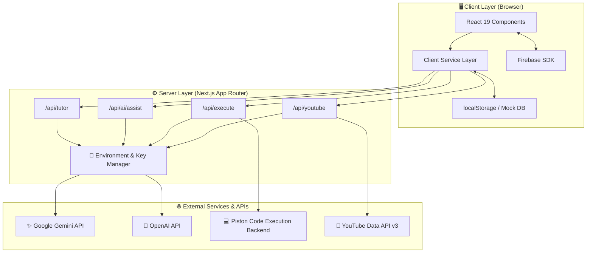

---

## 🎨 Frontend

Built with modern React and Next.js, featuring a fluid UI and interactive 3D elements.

### Frontend Tech Stack
- **Framework**: Next.js 16 (App Router)
- **Library**: React 19 & TypeScript
- **Styling**: Tailwind CSS v4
- **UI Primitives**: Radix UI (Dialog, Tabs, Select, Progress, Dropdown Menu, Slider, Tooltip)
- **Animations**: Framer Motion
- **3D Experiences**: React Three Fiber & Three.js (Interactive Solar System / Universe hero)
- **Icons**: Lucide React

### Key Frontend Views (`src/app/(app)/`)
- `/dashboard`: Unified student command center
- `/admin`: Superadmin control panel & user account directory
- `/ai-tutor`: Conversational AI tutor interface
- `/coding-lab`: Multi-language code editor & execution workspace
- `/courses` & `/subjects`: Curriculum catalog and lesson player
- `/practice` & `/quiz/[id]`: Quiz runner and answer explanations
- `/planner`: Task management and study schedule tracking
- `/resources`: YouTube educational video search workspace
- `/analytics`: Performance analytics dashboard

---

## ⚙️ Backend

Next.js server-side API routes serve as the secure backend orchestration layer.

### Backend Responsibilities
- 🔌 **API Route Dispatching**: Handles client requests cleanly under `/api/`.
- 🤖 **AI Prompt Construction**: Formats user requests and system prompts for Gemini/OpenAI.
- 🎥 **YouTube Proxy**: Securely calls YouTube Data API using server-side keys and caches results for 30 minutes.
- 💻 **Code Execution Proxy**: Communicates with the Piston execution engine or local host runtimes.
- 🔐 **API Key Isolation**: Ensures all third-party API keys (`GEMINI_API_KEY`, `YOUTUBE_API_KEY`, `EXECUTE_API_KEY`) remain strictly on the server.
- ⚠️ **Consistent Error Contract**: Converts backend exceptions into structured `ApiClientError` responses.

---

## 🔌 API Documentation

All API endpoints are hosted server-side under Next.js App Router API routes:

| Endpoint | Method | Description | Request Body / Query |
|---|---|---|---|
| `/api/tutor` | `POST` | Generates AI tutoring response for academic doubts | `{ message, history, userProfile }` |
| `/api/ai/assist` | `POST` | AI coding assistant (explain, debug, optimize, test cases, convert) | `{ action, code, language, targetLanguage }` |
| `/api/execute` | `GET`, `POST` | Fetches available language runtimes (`GET`) or executes code (`POST`) | `{ code, language, stdin }` |
| `/api/youtube` | `GET` | Searches YouTube for educational videos | `?q=query&order=relevance&maxResults=15` |

---

## 🧠 AI Architecture

The platform uses an AI provider dispatch layer that defaults to Google Gemini with support for OpenAI.

```
Student Ask Doubt / Code Assistance
               │
               ▼
     Next.js API Route (/api/tutor or /api/ai/assist)
               │
               ▼
     Active Provider Dispatcher (src/lib/ai/index.ts)
               │
      ┌────────┴────────┐
      ▼                 ▼
✨ Google Gemini     🤖 OpenAI
  (gemini-3.6-flash)   (gpt-4o-mini)
      │                 │
      └────────┬────────┘
               ▼
     Structured Markdown Response
               │
               ▼
     Student Interface Render
```

---

## 🔗 External Integrations

- ✨ **Google Gemini API**: Primary AI provider (`gemini-3.6-flash`) for doubt solving and code intelligence.
- 🤖 **OpenAI API**: Alternate AI provider (`gpt-4o-mini`) 
- 🎥 **YouTube Data API v3**: Enables real-time educational video discovery.
- 💻 **Piston Backend**: Public or self-hosted Piston execution engine for 24+ programming languages.
- 🔥 **Firebase SDK**: Firebase Auth, Firestore, and Analytics integration support in `src/lib/firebase.ts`.

---

## 💾 Data & Storage

- **Client Storage Abstraction**: User data, study goals, custom test cases, code snippets, and quiz history are persisted via an abstracted `localStorage` service (`src/lib/storage.ts`).
- **Static Curriculum Data**: Curated course structure and quiz questions are maintained in `src/data/`.
- **Firebase SDK**: Native Firebase configuration (`src/lib/firebase.ts`) is ready for optional cloud sync.
- **Production Migration Path**: The storage abstraction allows seamless swapping of `localStorage` for a PostgreSQL/MongoDB/Firebase database without modifying frontend components.

---

## 📂 Project Structure

```
Smart-Digital-Learning-Platform/
├── README.md
├── package.json
├── package-lock.json
├── next.config.ts
├── tsconfig.json
├── eslint.config.mjs
├── postcss.config.mjs
├── .env.example
├── .gitignore
│
├── public/
│
├── screenshots/
│   ├── landing.png
│   ├── dashboard.png
│   ├── ai-tutor.png
│   ├── coding-lab.png
│   └── resource-hub.png
│
└── src/
    ├── app/
    │   ├── (app)/
    │   │   ├── ai-tutor/
    │   │   ├── analytics/
    │   │   ├── coding-lab/
    │   │   ├── courses/
    │   │   ├── dashboard/
    │   │   ├── explore/
    │   │   ├── planner/
    │   │   ├── practice/
    │   │   ├── profile/
    │   │   ├── quiz/
    │   │   ├── resources/
    │   │   ├── settings/
    │   │   ├── subjects/
    │   │   └── weakness/
    │   ├── (auth)/
    │   ├── (marketing)/
    │   ├── onboarding/
    │   └── api/
    │       ├── ai/assist/
    │       ├── execute/
    │       ├── tutor/
    │       └── youtube/
    │
    ├── components/
    │   ├── ai/
    │   ├── analytics/
    │   ├── coding/
    │   ├── dashboard/
    │   ├── landing/
    │   ├── layout/
    │   ├── planner/
    │   ├── practice/
    │   ├── resources/
    │   └── ui/
    │
    ├── config/
    ├── data/
    ├── lib/
    │   ├── ai/
    │   ├── server/
    │   ├── env.ts
    │   ├── firebase.ts
    │   ├── storage.ts
    │   └── utils.ts
    │
    ├── services/
    └── types/
```

---

## 🛠️ Technology Stack

| Layer | Technology | Purpose |
|---|---|---|
| **Frontend Framework** | Next.js 16 + React 19 | Application architecture and SSR/SSG rendering |
| **Language** | TypeScript 5 | Type-safe client and server development |
| **Styling** | Tailwind CSS v4 | UI styling and responsive layouts |
| **UI Components** | Radix UI Primitives | Accessible UI components |
| **Animation** | Framer Motion | Smooth page transitions and micro-interactions |
| **3D Graphics** | React Three Fiber & Three.js | Interactive hero universe |
| **Backend API** | Next.js API Routes | Server-side endpoints and proxies |
| **AI Providers** | Google Gemini / OpenAI | AI Tutoring & Coding Assistance |
| **Video Integration** | YouTube Data API v3 | Resource discovery |
| **Code Execution** | Piston Backend Proxy | 24+ language sandbox execution |
| **Storage & SDK** | `localStorage` + Firebase SDK | Browser state persistence & cloud readiness |

---

## 🚀 Getting Started

### 1️⃣ Clone the Repository
```bash
git clone https://github.com/vaibhav08singh/-Smart-Digital-Learning-Platform.git
cd -Smart-Digital-Learning-Platform
```

### 2️⃣ Install Dependencies
```bash
npm install
```

### 3️⃣ Configure Environment Variables
Copy the example environment file:
```bash
cp .env.example .env.local
```

Edit `.env.local` with your API keys:
```env
# AI Tutor Provider (Google Gemini or OpenAI)
AI_API_KEY=your_gemini_api_key

# YouTube Data API Key
YOUTUBE_API_KEY=your_youtube_api_key

# Code Execution Backend (Optional: defaults to public Piston API)
EXECUTE_API_URL=https://emkc.org/api/v2/piston
EXECUTE_API_KEY=
```

### 4️⃣ Access the Application

- **Live Production Platform**: [https://smart-digital-learning-platform.vercel.app/](https://smart-digital-learning-platform.vercel.app/)

To run locally:
```bash
npm run dev
```

---

## 📜 Available Commands

| Command | Description |
|---|---|
| `npm run dev` | Starts the Next.js development server locally |
| `npm run build` | Compiles and builds the production bundle |
| `npm start` | Starts the Next.js production server |
| `npm run lint` | Runs ESLint checks across all codebase files |

---

## 💻 Code Execution Setup

The **Coding Lab** uses a server-side proxy (`/api/execute`) that forwards execution requests to a Piston-compatible engine.

- Default endpoint: `https://emkc.org/api/v2/piston`
- For production or self-hosted deployment, configure `.env.local`:
```env
EXECUTE_API_URL=https://your-custom-piston-instance.com/api/v2/piston
EXECUTE_API_KEY=your_piston_api_key
```

---

## 🔐 Security

- **Server-Side API Keys**: Third-party API keys (`AI_API_KEY`, `YOUTUBE_API_KEY`, `EXECUTE_API_KEY`) are kept on the server and never exposed to the client bundle.
- **Git Protection**: `.env.local` is ignored by git (`.gitignore`) to prevent accidental key exposure.
- **API Proxy Pattern**: All external API interactions pass through Next.js server endpoints `/api/`.
- **Sanitized Execution**: Code execution takes place inside sandbox environments.

> ⚠️ **Security Note**: Never commit actual API keys or credentials to public repositories.

---

## 🏆 Why This Project?

- 🌐 **All-in-One Learning Ecosystem**: Replaces 6+ fragmented apps with one unified platform.
- 🤖 **AI Integrated into Workflow**: AI tutoring and coding assistance are embedded directly inside learning paths.
- 💻 **Learn by Doing**: Students immediately test concepts in an integrated 24-language Coding Lab.
- 📚 **Structured & Curated**: Organizes resources into structured academic curricula.
- 📊 **Data-Driven Progress**: Monitors theoretical understanding, quiz scores, and coding activity in real time.
- 🧩 **Scalable Architecture**: Clean modular design separating client UI, API proxies, and storage.

---

## 🏆 Smart India Hackathon

| Hackathon Details | Information |
|---|---|
| 👥 **Team Name** | **Code Zen** |
| 🚀 **Project Name** | **Smart Digital Learning Platform** |
| 🎯 **Core Objective** | Empower students with a unified AI-powered learning environment: **Learn → Ask → Practice → Assess → Plan → Track → Improve** |

The **Smart Digital Learning Platform** addresses the digital divide and fragmentation in online education, offering a scalable, accessible solution for Indian students across school and university levels.

---

## 🔮 Future Scope

*The following features represent planned future enhancements:*

- 🗄️ **Production Cloud Database**: Migration from browser storage to PostgreSQL / Supabase / MongoDB.
- 👥 **Real-Time Peer Collaboration**: Multi-user study rooms and pair-programming sessions.
- 🎙️ **Voice AI Assistance**: Voice-based Q&A interaction with the AI Tutor.
- 🤖 **Adaptive Learning Paths**: Machine-learning driven course recommendations based on student weak spots.
- 📄 **Exportable Progress Reports**: Automated PDF academic performance reports for mentors and parents.
- ☁️ **Cloud Container Execution**: Isolated Docker execution containers for advanced software frameworks.

---

## 📸 Screenshots Gallery

<div align="center">

| Showcase View | Preview |
|---|---|
| **Hero Experience** |  |
| **Learning Levels** |  |
| **3D Knowledge Universe** |  |
| **Knowledge Domains** |  |
| **Platform Pillars** |  |
| **Landing Page** |  |
| **Student Dashboard** |  |
| **AI Tutor** |  |
| **Course Catalog** |  |
| **Subject Syllabus** |  |
| **Coding Lab** |  |
| **Study Planner** |  |
| **Weakness Detector** |  |
| **Resource Hub** |  |
| **Student Profile** |  |
| **Activity Feed & XP** |  |
| **User Sign Up** |  |
| **Admin Control Panel** |  |

</div>

---

## 👥 Team

**Team Name**: **Code Zen**  
**Project Name**: **Smart Digital Learning Platform**

---

<div align="center">

# 🚀 Smart Digital Learning Platform
### Powered by Team Code Zen
**Learn Smarter • Code Better • Build Your Future**

</div>
